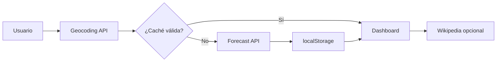

# Modelo de datos — Dashboard del Clima

Este documento describe las estructuras de datos que circulan entre las APIs externas, la caché local y la interfaz.

## 1. Geocodificación (Open-Meteo)

**Endpoint:** `GET https://geocoding-api.open-meteo.com/v1/search`

| Campo (respuesta) | Tipo | Uso en la app |
|-------------------|------|----------------|
| `results[].name` | string | Nombre de ciudad mostrado |
| `results[].latitude` | number | Consulta del clima |
| `results[].longitude` | number | Consulta del clima |
| `results[].country` | string | Subtítulo / etiqueta |
| `results[].country_code` | string | Filtro por país (ej. `ES`, `CO`) |
| `results[].admin1` | string | Región en autocompletado |
| `results[].population` | number | Ordenar candidatos |

**Objeto interno tras geocodificar:**

```json
{
  "ciudad": "Cali",
  "pais": "Colombia",
  "latitud": 3.45,
  "longitud": -76.53
}
```

## 2. Pronóstico meteorológico (Open-Meteo)

**Endpoint:** `GET https://api.open-meteo.com/v1/forecast`

### `current` (tiempo actual)

| Campo | Tipo | UI |
|-------|------|-----|
| `temperature_2m` | number | Temperatura principal (°C) |
| `weather_code` | number | Emoji + texto vía WMO |
| `relative_humidity_2m` | number | Tarjeta humedad |
| `apparent_temperature` | number | Sensación térmica |
| `wind_speed_10m` | number | Viento (km/h) |
| `wind_direction_10m` | number | Cardinal (N, NE, …) |
| `uv_index` | number | Índice UV + nivel textual |

### `daily` (5 días)

| Campo | Tipo | UI |
|-------|------|-----|
| `time[]` | string (ISO date) | Día de la semana |
| `weather_code[]` | number | Emoji por día |
| `temperature_2m_max[]` | number | Máxima |
| `temperature_2m_min[]` | number | Mínima |
| `precipitation_probability_max[]` | number | % lluvia (si > 0) |

## 3. Códigos WMO (`weather_code`)

Enteros definidos por la OMM. La app los traduce con el diccionario `WMO_CODES` (ver `lib/wmo.mjs` e `index.html`).

Ejemplos: `0` = despejado, `61` = lluvia ligera, `95` = tormenta.

## 4. Caché en `localStorage`

| Clave | Valor |
|-------|--------|
| `wc-{lat}_{lon}` | `{ "timestamp": number, "datos": <respuesta forecast> }` |
| `historial-ciudades` | `string[]` (máx. 5 etiquetas) |
| `tema` | `"light"` \| `"dark"` |

**TTL:** 3 600 000 ms (1 hora). Tras expirar, la entrada se elimina.

## 5. Estado de sesión (memoria)

| Variable | Contenido |
|----------|-----------|
| `ultimaConsulta` | `{ latitud, longitud, ciudad, pais }` |
| `ciudadesComparacion` | `string[]` (etiquetas, máx. 6) |
| `imagenesFondo` | `{ url, titulo, ubicacion, extracto }[]` |

## 6. Flujo de datos (resumen)


